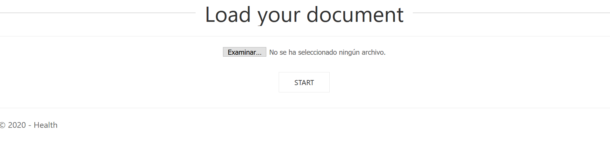
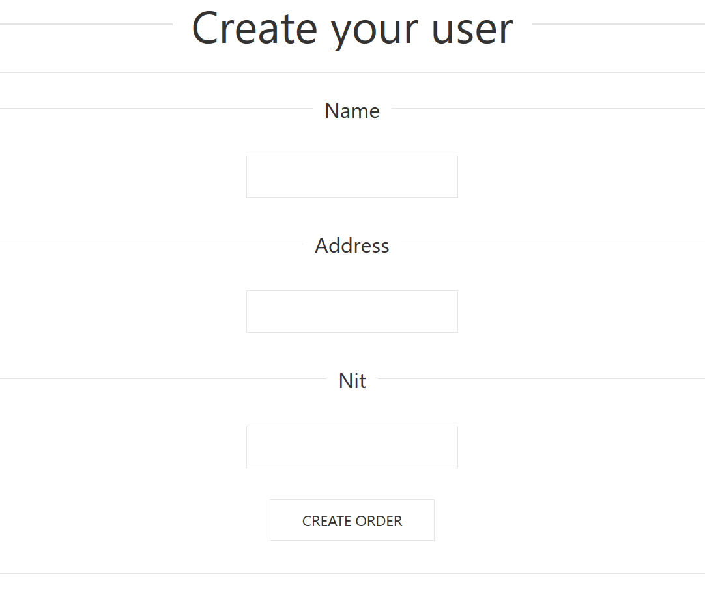
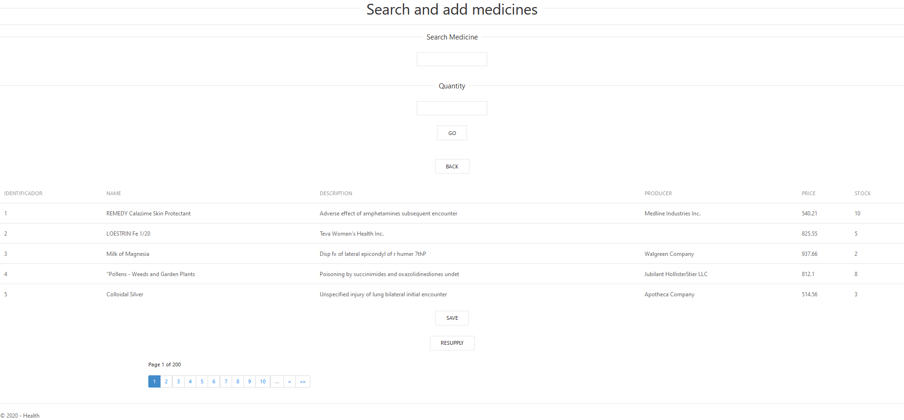
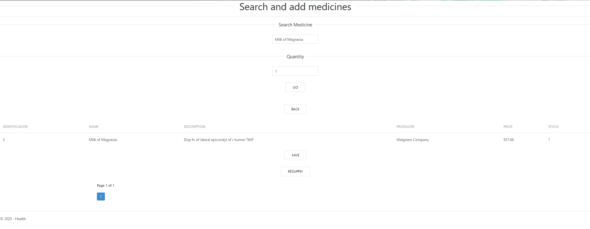
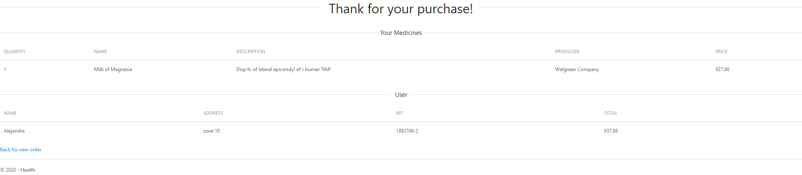

<h2>Health Medicine</h2>

Una empresa dedicada a la distribución de medicamentos en toda Guatemala.

La aplicación funciona con la siguiente interfaz:
Ingrese en la aplicación.

Suba un archivo .csv con el inventario de los medicamentos.
 
Ingrese sus datos de usuario. 
 
Luego se le mostrará el listado de medicamentos disponibles.
Además, puede presionar el botón de "Resupply" para reabastecer el inventario de medicamentos. 
 
Para buscar un medicamento, deberá ingresar el nombre del medicamento y la cantidad que necesite. 
Si el medicamento está disponible, se agregará a su lista de compras, sino, puede buscar otro medicamento.
O puede volver al menú principal presionando "Back"
 

Al terminar su compra, presione el botón de "Save" y se le mostrará la pantalla final con el nombre al cual ingreso la orden
y las medicinas que solicito. 
 
